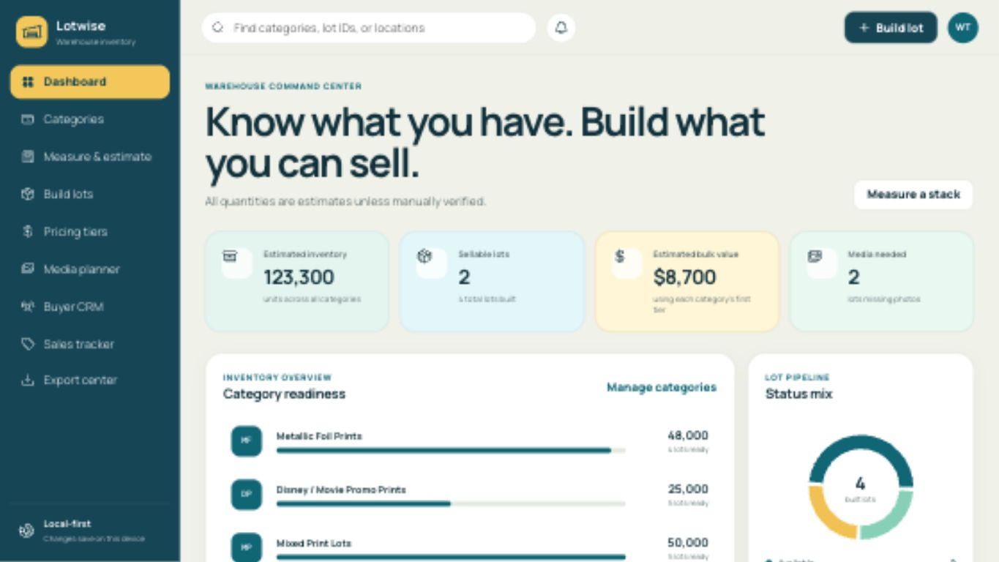

# Lotwise: Janiak Warehouse Inventory

A local-first React application for turning mixed warehouse inventory into measured, priced, controlled buyer lots.



## Product status

**Usable public demo.** Lotwise runs entirely in the browser, keeps warehouse data on the current device, and includes tested print-stack and object-inventory workflows. It is ready for demonstrations and single-device field use. Shared accounts, hosted persistence, and transactional audit history remain roadmap work.

## Run locally

```bash
pnpm install
pnpm dev
```

Open the local URL printed by Vite. Data is saved in browser `localStorage`; no account or cloud backend is required for this first version.

On macOS, `Launch Lotwise Demo.command` provides a double-click launcher after dependencies are installed.

## Included in this first working version

- Seeded print, frame, framed-art, mirror, and framing-material categories
- Editable category setup
- Dynamic category-variable builder with pricing and buyer-visibility controls
- Live stack-thickness inventory calculator
- Dynamic object entry with dimensions, size class, condition, quality, material, and live pricing
- Individual object register with search and size/condition filters
- Physical volume, lot, remainder, and value calculations
- Category-specific pricing tier editor
- Governed print and object lot generation with exact-piece assignment and anti-cherry-picking rules
- Printable buyer-facing lot cards
- Media shot list and filenames
- Responsive dashboard with local inventory summary
- CSV lot-register and JSON backup exports
- Persistent, printable warehouse variable checklist
- Double-click demo launcher with same-Wi-Fi phone access
- Calculation tests for both the supplied 240-inch example and framing/object pricing scenarios

## Test and build

```bash
pnpm test
pnpm build
```

## Calculation baseline

For Metallic Foil Prints, the seed data uses 500 pieces per 2.5 inches, or 200 pieces per inch. A 240-inch total stack therefore estimates 48,000 pieces: four full 10,000-piece lots plus an 8,000-piece / 40-inch remainder. At $500 per 10,000, estimated bulk value is $2,400 and price per inch is $10.

## Data note

Estimates remain labeled as estimates until manually verified. Framing records are stored locally alongside print measurements and can be included in JSON backups. The next persistence pass can replace browser storage with SQLite while keeping the same data model and interface.

No warehouse records, credentials, or customer data are committed to this repository. The included records are demonstration seed data.

## Development documentation

The complete development record is indexed in [`docs/README.md`](docs/README.md), covering product requirements, UX, architecture, data, calculations, features, testing, operations, governance, roadmap, and changelog.

## Warehouse demo

Double-click `Launch Lotwise Demo.command` and keep its Terminal window open. See `DEMO-INSTRUCTIONS.md` for same-Wi-Fi phone access and warehouse preparation.

## Repository map

- `src/` — application components, state, seed data, calculations, and exports
- `docs/` — product requirements, architecture, governance, operations, and roadmap
- `qa/` — visual and workflow verification evidence
- `DEMO-INSTRUCTIONS.md` — field-demo startup and phone-access guidance

## Ownership

Lotwise is an active Janiak warehouse-operations project. No open-source license has been granted yet; the public repository is provided for demonstration and evaluation.
